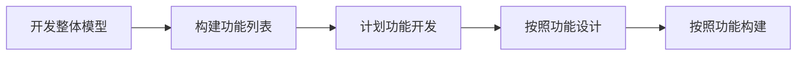

# 敏捷框架

### 2.1 已经定义的工作和不确定的工作 ###

​	迭代、增量

| 传统软件开发   | 敏捷软件开发       |
| :------------- | :----------------- |
| 官僚、慢、庞大 | 快速响应、适应变更 |

### 2.2 敏捷宣言 ###

敏捷开发宣言：

1. 个体和交互高于流程和工具

   以人为本，项目是由人来执行的，而不是工具。

2. 可交付的软件高于完备的文档

   强调传递信息的必要性，可交付软件时更有价值的，而文档需要精简，而不厚重

3. 客户合作高于合同谈判

   及时与客户沟通

4. 拥抱变化高于遵循计划

   互联网的高速发展，可能一个软件在开发过程中已经不适应时长，需要拥抱变化。

   虽然敏捷团队致力于响应变化，但并不是不需要计划，反而需要更多的规划。在敏捷开发中要避免2种极端：1、根本不做任何计划

   2、在计划上投入大量精力

   敏捷开发方法：规划—执行—调整

***ps:尽管右项有其价值，我们更重视左项的价值***

在敏捷宣言中，不能简单理解为“做A而不做B”，应该是当A和B同时出现时，优先强调A而不是强调B。敏捷时一种执行项目的能力，时需要我们将更多经理放在宣言种左边项，而不是右边项。

### 2.3 敏捷原则 ###

12条敏捷指导原则：

1. 我们最高优先级的工作任务是通过尽早和持续不断地交付有价值的软件，来满足客户的需要

   三个重点：

   1. 首先让客户满意：客户才是最后验收的人
   2. 其次就是尽早地持续交付：通过频繁迭代和客户形成良好合作，及时反馈可以提高产品质量
   3. 最后就是要交付有价值的软件，而不是没有完成的工作产品：关注在项目最终的目标上

2. 我们欢迎需求变更，及时是到开发后期也欢迎。敏捷过程将会通过变更，而使客户获得竞争优势

   拥抱变更可以使项目长时间处于高适应性和灵活性的环境下

3. 经常交付可使用的软件，交付周期从几个星期到几个月不等，时间间隔越短越好

   交付的工作在测试环境下得到测试反馈，开发人员交付可以工作的软件，并且要尽早地、经常性地交付它

4. 在项目进行过程中，业务人员和开发人员应该开展日常协作工作

5. 使用积极主动的成员来参与项目，并提供给他们所需要的支持和环境，信任他们能够完成工作

   激发成员斗志，提供好的环境和支持，对他们有完全的信任

6. 面对面交流时开发团队种最迅速也是最有效的信息交流方式

   在建立标准上，文档是重要的，但是在交流中，文档可以起到辅助说明作用，但是面对面才是最有效的

7. 可使用的软件时项目进展状况的主要度量

   **“可使用”**软件是度量项目进度的标准，没有完成的用户故事在计算进站时，不能将其计算在内

8. 敏捷过程体长可持续的开发速度。发起人、开发者和用户应该能保持一个长期的、恒定的开发速度

   可持续和恒定是创造欢快气氛和生产力的源泉

9. 对卓越技术和良好设计的持续关注有助于提高项目的敏捷性

10. 简化（尽最大可能减少不必要的工作）是一门艺术

    代码的质量需要另外的原则来保证：随时重构。

11. 最佳的架构、需求和设计都源于自我管理的团队

    敏捷团队是自组织团队，任务按照团队为单位进行分配，敏捷团队成员共同解决所要完成的需求，敏捷环境倡导全栈式工作，一可以提高生产力，二是可以让成员参与到任务的各个方面

12. 在有规律的时间间隔种，项目团队要思考如何提高后面的工作效率，然后相应地调整自己的行为

    要有规律的进行**“回顾”**

***ps:在考试中遇到两个相似答案的时候，选择最符合敏捷价值观和原则的答案***

### 2.4 项目开发生命周期 ###

#### 2.4.1 预测型生命周期 ####

适用：充分了解交付的茶品，有厚实的行业实践基础，整批一次性交付产品有利于相关方

#### 2.4.2 迭代型生命周期 ####

迭代型将项目分成很多个冲刺（Sprint），在每一个冲刺中都会运行一次开发过

适用管理技术风险，不断演化需求

#### 2.4.3 增量型生命周期 ####

将产品分成很多个模块

适用：管理日常风险，可以应对小的需求变更，但是难以处理影响到架构的变更

#### 2.4.4 混合型生命周期 ####

将预测型生命周期和适应性声明周期混合在一起使用

适用：组织从传统管理过度到敏捷管理，需要使用每种生命周期的优点时

#### 2.4.5 不确定性、风险和生命周期的选择 ####

根据具体的项目情况，选择合适的生命周期。

### 2.5 敏捷的框架和方法 ###

最常用的就是Scrum和极限编程（XP）

#### 2.5.1 Scrum ####

Scrum是敏捷项目管理的框架。将团队比作橄榄球队，团队具有明确且清晰的方向和目标，每个团队成员都具备很强的进攻及防范能力，具有高度自主权。

##### 1. Scrum的三大支柱 #####

1. 透明性

   软件开发过程的每个环节都保持高度的可见性，影响交付成果的各个方面对于参与交付的所有人、管理生产成果的人保持透明

2. 检验

   开发过程中的各方面必须做到足够频繁的检验，确保能够及时发现过程中的重大偏差，定期检测，持续改进

3. 适应

   检查人员经检验发现过程中的一个或多个方面不满足验收标准，并且最终产品是不合格的，那么检察院就必须对过程进行调整。调整工作必须尽快实施以减少偏差

三大支柱所需做的工作

1. 冲刺回顾
2. 每日立会
3. 冲刺评审会议
4. 冲刺计划会议

##### 2. Scrum团队 #####

1. 开发团队

   只有开发团队的成员才能创造增量。

   1. 自组织，没有人告诉他们如何把产品待开发列表变成潜在可发布的功能
   2. 开发团队是跨职能的，团队作为一个整体拥有创造产品增量所需要的全部技能
   3. 开发团队没有头衔，每个人都是开发者
   4. 每个成员可以又特长和专注领域，但是责任归属于整个开发团队
   5. 开发团队不包括测试或业务分析等负责特定领域的子团队

2. 产品负责人

   可以理解为**产品经理**（但不是产品经理，这个很重要），是最终对产品负责的人，对产品待开发想具有决策权的人，增删改其中的条目，或者重新排序都要产品负责人同意

   1. 清晰表达产品待开发项目
   2. 对产品待开发项目中的条目进行优先级排序，更好的时先目标和视频
   3. 确保开发团队嗦执行工作的价值
   4. 确定产品待开发项对所有人透明、清晰，并且现实Scrum团队下一步的工作
   5. 确保开发团队对产品的待开发项目有一定理解

3. Scrum Master

   确保Scrum被正确地理解和实施。当好团队的牧羊犬，防止团队收到外界干扰，并且当团队遇到障碍时，可以帮助团队清除障碍。时仆人式的领导

   服务产品负责人：

   1. 找到有效管理产品待开发项列表的技巧
   2. 和开发团队清晰地沟通愿景、目标和产品待开发项
   3. 交代开发团队创建清晰简明的产品待开发项
   4. 在经验主义环境中理解长期的产品规划
   5. 理解并实践敏捷
   6. 按需推动Scrum活动

   服务于开发团队：

   1. 知道开发团队自组织和跨职能
   2. 教导并领导开发团队创造高价值的产品
   3. 移除开发团队进展过程中的障碍
   4. 按需推动Scrum活动
   5. 在Scrum还未完全被接纳和理解的组织环境下知道开发团队

   服务于组织：

   1. 领导并指导组织采用Scrum
   2. 在组织范围内计划Scrum的实施
   3. 帮助员工及相关方理解并实施Scrum和经验性产品开发
   4. 发起能提升Scrum团队生产力的变革
   5. 于其他Scrum Master 一起工作没帮助组织更有效地应用Scrum

   ##### 3. Scrum仪式 #####

   1. 冲刺

      一个时间盒，在这个时间盒中至少应该有产品发布，每一个冲刺都包括一个冲刺计划回忆、每日Scrum例会、开发的工作、冲刺评审会议及冲刺回顾会议。在冲刺期间一般不会产生影响冲刺目标的事请，但是有时候需要新需求的时候，需要和产品负责人对范围进行澄清和商谈

   2. 冲刺规划会议

      一个冲刺规划会议用于确定在这个冲刺中需要交付那些产品，以及如何达成目标。

      一个冲刺会议包括两部分工作：决定在冲刺中需要完成哪些工作，决定这些工作如何完成。

      要做多少工作由开发人员决定，其他任何人不能给开发团队增加更多的工作量

      **最终产生的待办事项列表就是“冲刺待开发项”（Sprint Backlog）**

   3. 每日立会

      1. 从上一个每日立会到现在，我完成了什么
      2. 从现在到下一个每日立会，我计划完成什么
      3. 有什么阻碍了我的进展

      每日立会只有简要的问题澄清和回答，但不是涉及到深入话题。每日立会可以带来透明性、信任和更好的绩效。所有的Scrum的会议都是限定时长的，每日立会通常不超过15分钟

   4. 冲刺评审

      冲刺评审时一个在冲刺结束的时候举办的会议，用来检查增量或者开发出来的产品，如果必要也可以对产品待开发项进行调整。先由开发团队证明工作已经“完成”，并回答任何问题，**产品负责人** 决定次增量是否“完成”。

   5. 冲刺回顾

      在冲刺结束的时候，团队回举行一个冲刺回顾会议以反思整个的过程及需要改进的地方。回顾会议在冲刺评审会议之后和下一个冲刺会议计划会议之前举行。

      冲刺回顾会议推荐市场：每一周对应一小时，及冲刺一周，建议开一小时的冲刺回顾

   ##### 4. Scrum工件 #####

   Scrum工件以不同的方式展现工作和价值，可以用来提供透明性，以及加烟和适应的机会，为了保证能最大化关键信息的透明性

   1. 产品待开发项（Product Backlog）

      产品待开发项由所有的功能特性组成，包括业务功能及非业务功能。一个完整的待开发项时一个蓝图，但是再Scrum中，待开发项时根据产品和产品使用环境的演化而不断演化的，所以待开发项是动态的，需要持续改进确保产品的最合理，最有竞争力，最有价值。产品待开发项优先级是一个很重要的视角，优先级越高，需要越清晰，越详细，反之越低，直到低到几步不能认为它是一个待开发项。

      Scrum不考虑在产品待开发项条目上的工作时间，只关心剩余工作和日期这2个变量。

   2. 冲刺待开发项

      冲刺待开发项时由产品待开发项分解而来的一系列的项。

      在冲刺中的任意时间点，冲刺待开发项的所有剩余工作总何都可以被计算。开发团队至少在每日立会时追踪所有的剩余工作。

      Scrum不考虑已经花在冲刺待开发项上的时间，只关心剩余工作和日期这两个变量

   3. 增量

      在一个Sprint完成之后所有的产品待办事项的总和，以及之前所有Sprint产生的增量价值的总何。增量必须满足“完成”的定义，并且带来价值。

#### 2.5.2 极限编程（XP）

XP适用于小团队开发

##### 1. XP的核心价值 #####

XP的核心价值是：简单、沟通、反馈、勇气、尊重

1. 简单

   XP鼓励从最简单的解决方式入手，再通过不断重构达到更好的结果。只关注于当前的需求来进行设计、编码，不去理会明天、下周或者下个月会出现的需求 

2. 沟通

   构建一个软件系统的基本任务之一，就是于系统的开发者交流以明确系统的具体需求。鼓励经常性的口头交流与反馈

3. 反馈

   “反馈”是和系统开发的很多不同方面相关联的

   1. 来自系统的反馈。通过编写单元测试，程序员能够很直观地得到经过修改后系统的状态
   2. 来自客户的反馈。功能性测试是由客户和测试人员来编写的。他们能由此得知当前系统的状态
   3. 来自小组的反馈。对客户带来的新需求进行评估并反馈。

   反馈是与“交流”“简单”这两条价值紧密联系的。

4. 勇气

   1. 只为今天的需求设计编码，不要考虑明天
   2. 了解什么时候应该完全丢弃现有的代码

5. 尊重

   对团队成员间的相互尊重，对工作的尊重

##### 2. XP的核心实践 #####

1. 完整的团队

   所有参与者在一个开放的场所一起工作，他们是同一个团队的成员。

2. 规划游戏

   XP中的需求分析，是通过规划游戏完成的。规划游戏贯串了项目开发的始终

   规划游戏分为三个阶段:

   1. 探测阶段：客户和开发人员一起把需求分解成很多小的、可估算的单元
   2. 计划阶段：客户和开发人员一起制定、发布计划
   3. 调整极端：客户和开发人员一起，在开发过程中，根据实际情况，及时调整原有的计划或者制定新计划

3. 小型发布

   XP强调在非常端的周期内以递增的方式发布新版本，从而可以很容易地估计每个冲刺周期的进度，便于控制工作量和风险，也可以及时处理用户的反馈。

4. 客户测试

   作为定义功能需求的一部分，客户会描述一个或多个测试以展示软件是如何工作的，然后团队构建自动化测试以证明满足了客户的要求

5. 共同所有权

   每个人都拥有更改代码的权力，所有人对全部代码负责

6. 编码标准

   通过指定严格的代码标准来进行沟通，尽可能减少不必要的文档。

7. 可持续的速度

   团队要以能够长期维持的速度努力工作，保存精力，把项目看作马拉松长跑，而不是全速短跑

8. 隐喻

   1. 寻求共识，借用双方比较熟悉的事物来做类比
   2. 发明共享词汇
   3. 创新的武器，借助其他东西来找到解决问题的新途径，比如将工作流看作一个生产线
   4. 描述体系结构

9. 持续集成

   持续集成是对这些最佳实践的基本支撑条件。要区分和小型发布的区别，小型发布时在开发周期中经常发布中间版本，而持续集成时要求团队每天尽可能多次地做代码集成。

10. 测试先行/测试驱动开发

    1. 如果开发人员已经保持了简单的设计，那么编写测试代码根本不难
    2. 如果开发人员在结对变成，那么如果能相处一个好的测试代码，那么他们的伙伴也一定行
    3. 当所有的测试都通过的时候，开发人员再也不用担心所写的代码进后会“暗箭伤人”
    4. 当客户看到所有的测试都通过的时候，开发人员会对程序充满前所未有的信心
    5. 当开发人员需要进行重构时，测试代码会给他们带来更大的勇气，因为测试是否重构成功只需要一个按钮

11. 重构

    重构是一种对代码进行改进而不影响功能时先的技术。重构通常发生两种情况之下

    1. 实现某个特性之前：尝试改变现有的代码结构，以使得实现新的特性更加容易
    2. 时先某个特性之后：检车刚刚写完的代码后，认真检查一下，看是否能够进行简化

    在考虑重构是，应该养成编写并经常运行测试代码的习惯。

12. 简单设计

    简单设计不是要忽略设计，而是设计不应该在编码之前一次性完成。

    概念中的简单设计：

    1. 能够通过所有测试程序
    2. 没有包括任何重复的代码
    3. 清除的表现了程序员赋予的所有意图
    4. 包括尽可能少的类和方法

    进行简单设计的方法：

    1. 写测试代码
    2. 每个类只负责一件事
    3. 一个对象应当对其他对象尽可能少地了解

13. 结对编程

    优点：

    1. 所有设计决策确保不是一个人做出的
    2. 系统的任何一部分都肯定至少有2个人熟悉
    3. 几乎不可能有2个人都忽略的测试项或者其他任务
    4. 结对组合的动态性，是一个企业只是管理的好途径
    5. 代码总是能够保证呗评审过
    6. XP方法集成的其他最佳实践也能是的结对变程更加容易进行
    7. 编码标准可以消除一些无谓的分歧
    8. 隐喻可以帮助伙伴更好地沟通
    9. 简单设计可以使得相互结对的伙伴更了解他们所从事的工作

#### 2.5.3 特性驱动开发(FDD) ####

FDD的良好实践：

1. 领域对象建模
2. 按照特性开发
3. 类（代码）所有权，每一个类都有一个制定的人或角色负责类代码的一致性、性能和概念的完整性
4. 特性小组，把类分配给一个确定的开发人员，由这个特性所有者协调多个开发人员的工作，特性组长是教练不是超级开发人员
5. 审查。评审可以帮助确保高质量的设计和编码
6. 配置管理保证对完成的代码文件最新版本的确认和礼是追踪
7. 定期构建。通过定期构建，能够使团队确保新的代码集成进现有的代码中
8. 可视性进度报告。

#### 2.5.4 动态系统开发方法 ####

DSDM的基本观点是，任何事请都不可能一次性地圆满完成，应该用20%的实践完成80%的有用功能，以适合商业目的为准。实施的思路是，在实践进度和可用资源预先古丁的情况下，力争最大化地满足业务需求。

DSDM的7个阶段：

1. 项目准备阶段。项目准备阶段确保启动、建立正确的项目。
2. 可行性研究阶段。不仅是项目的可行性，还有DSDM的可行性
3. 业务研究阶段
4. 功能建模阶段（冲刺式）。先自己分析，在交给用户评审，再进一步充实和改进。功能建模阶段会产生以下产物：
   1. 带有优先级的功能
   2. 功能性原型的评审文档，每次评审的建议都需要记录
   3. 非功能性需求
   4. 实施计划
5. 系统设计编程阶段（冲刺式）测试贯穿于整个功能建模和设计编码过程
6. 实施阶段。主要培训客户，完成系统从开发环境向运行环境的交接，然后评估这一阶段完成的需求，下一个阶段需要做哪些工作。这个阶段，部分隐藏的系统性能问题也可能会暴露出来，也需要关注
7. 项目后期。项目后期应评审当前使用的方案并评估是否达到预期的效果

#### 2.5.5 水晶 ####

以人为中心的理念，但时间和XP不同，考虑到人很难严格遵循一个纪律约束很强的过程。

Crystal Clear（透明水晶）：C6、D6

Crystal Yellow（黄水晶）：C20、D20、E20

Crystal Orange（橙水晶）：C40、D40、E40

Crystal Red（红水晶）：C80、D80、E80

水晶方法拥抱很多其他的敏捷原则：

1. 频繁地交付。水晶发放构建解决方案的增量，并且检查这些增量被验收
2. 反思改进
3. 渗透式沟通。当一个员工提出问题，其他成员可以根据自己的意愿加入这个问题的讨论中来，也可以继续忙自己的工作
4. 个人安全。
5. 焦点
6. 与专家用户建立方便的联系
7. 配有自动测试、配置管理和经常集成功能的技术环境。

#### 2.5.6 精益开发 ####

精益开发（LEAN）不是一种敏捷的方法，但是精益和敏捷的价值观是紧密相关的。

1. 消除浪费。为了最大化价值，必须最小化浪费
2. 构建质量。在整个开发过程中构建产品质量和持续地确保质量
3. 创建知识。时刻保持学习的状态
4. 推迟决策。决策太早不能获得足够的所需信息，决策太晚会使你承担更高的成本风险
5. 快速交付。
6. 对人尊重
7. 整体优化。

#### 2.5.7 看板开发 ####

看板的5个核心实践：

1. 可视化工作（价值）流

   把抽象不可见的工作流可视化

2. 限制在制品数量

3. 度量和管理流动

   快速、顺畅的价值流动时看板开发方法的目标

4. 协同改进

5. 显示化流程规则

   明确定义和沟通团队所遵循的流程规则

### 2.6 实施敏捷的环境 ###

#### 2.6.1 服务型领导的职责 ####

1. 敏捷领导力
2. 服务型领导
   1. 保护团队不受干扰
   2. 移除工作中的障碍
   3. 沟通项目愿景
   4. 为团队带来食物和水

#### 2.6.2 团队组成与工作空间 ####

1. 敏捷团队

   敏捷团队通常拥有**3-9**人。

2. 敏捷角色

   在不同的敏捷方法中，角色有时时不一样的

3. 通才型专家

   敏捷倡导的时全栈式工程师，要求这类团队成员是**T型人才**，要有宽度，也要有深度

4. 团队结构

5. 工作场所

   敏捷倡导面对面沟通，需要将所有团队成员安排在同一个办公地点。

6. 克服组织孤岛

   让团队尽可能拥有基本信任和安全的工作环境，保证每个团队成员都具有话语权并被参考

