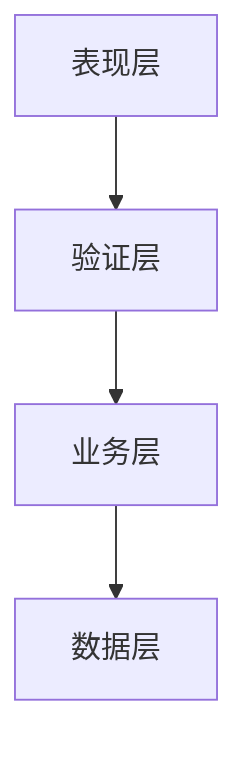

# 敏捷计划、估算、监控和适应

### 5.1 用户故事

#### 5.1.1 用户故事和待开发项

用户故事是从用户的角度来描述用户渴望得到的功能。一个好的用户故事包括3个要素：

1. 角色：谁要使用这个功能
2. 活动：需要完成什么样的功能
3. 商业价值：为什么需要这个功能，这个功能带来什么样的价值

用户故事不能够使用技术语言来描述，要使用用户可以理解的业务语言来描述

**INVEST原则**：

1. 独立性（independent）：用户故事之间应该具有独立性，不应该依赖于其他的用户故事。
2. 可协商性（negotiable）：用户故事不是签订的商业合同，它是由客户或者产品负责人同开发小组的成员共同协商制定的。
3. 有价值的（valuable）：用户故事必须对最终的用户是有价值的，因此应该站在用户的角度去编写，描述的是一个一个特性，而非任务
4. 可估算的（estimable）：对一个用户故事的划分需要足够的领域知识，使得再划分故事时就能大致了解故事开发的周期。为了减少估算的不确定性，故事本身不能**太大**
5. 小的（small）：故事应该**尽量**短小，庨的故事可以减少划分过程中估算的误差，最好的故事是能够再一个冲刺周期之内完成。
6. 可测试的（testable）：如果以一个用固话故事无法进行测试，那么就无法定义故事是否完成，其次，对应的验收测试也最好是自动运行的，这样在任何时候都能触发该用户故事的检验。最后必须再定义了验收测试通过的标准后才能认为故事划分完毕。

当开发软件系统时，故事也会将相关系统的整个架构层次切成垂直的功能块：

可以基于不同的技术层次，对故事进行分割，从而撰写用户故事以提供全面的功能。这样做的好处有一下几点：

1. 减少架构风险
2. 更容易排列用户故事的优先级
3. 以为特性的完成，软件可以今早发布
4. 有利于自动化测试

1. ##### 用户故事的待开发项

   在用户故事被创建完成之后，需要将他们放入待开发项中，用户故事的待开发项可以为团队的需求优先级提供帮助。用户故事的待开发项可以允许对列表中的内容进行修正和更新。

2. ##### 需求的层次

   作为一个大型项目往往是复杂的，大量的工作难以计划和股癣，所以敏捷团队需要将这些工作拆为更小的质感，直到可以准确地估算和构建这些需求。

#### 5.1.2 用户故事地图

用户故事地图，就是一堵Story墙，大级别的用户故事排在偷拍，根据优先级，描述用户需求。

用户故事地图的最大特点就是可以完整地讲述整个客户的体验。

它让敏捷团队可以：

1. 更容易看清待开发项（Backlog）的全貌
2. 为产品待开发项梳理（Product Backlog Grooming）和优先级排序（Prioritizing）提供更好的工具，帮助做出决策
3. 辩越使用静默头脑风暴模式和其他写作方式来产生用户故事
4. 帮助开发人员更好地进行迭代增量式开发，同事确保早期的发布可以验证整体架构和解决方案
5. 为传统的项目计划提供了一个更好的替代工具
6. 有助于激发讨论和管理项目范围
7. 允许从多个维度进行项目规划，并确保不同的想法都可以得到考虑和探讨
8. 帮助回以巨头细节
9. 预防信息蒸发

#### 5.1.3 梳理待开发项

梳理待开发项也成为Backlog梳理活动，Backlog梳理活动是在下个冲刺开始钱，对可能要纳入冲刺中的故事进行细化、估算和优化排序的活动。在这个活动中，PO、SM和团队都应该参加。

以下是Backlog梳理活动的过程

1. PO和团队一起讨论用户故事的北京、业务目标、用户角色、用户场景、业务流程、业务规则，保证团队理解充分并且无意义

2. PO和团队一起讨论界面和交互流程，画出低保真和交互流

3. PO和团队讨论用户故事的测试要点、技术事现方案、可能存在的技术风险，必须输出测试要点（验收标准），测试要点形式不限。其中可以分为以下3个过程：

   1. PO与一个自身测试人员讨论和整理出测试要点
   2. PO与整个开发团队交流用户故事的测试要点
   3. 开发团队讨论初步技术实现方案、技术风险

   其中注意事项为：1、要先准备好，避免从零开始；2、讨论初步技术事现方案的目的是做估算、识别技术依赖及技术风险，详细的应该带冲刺开发时再讨论

4. 团队估算出用户故事的规模（故事点数），对于过大的用户故事要拆分成小故事，其中包括以下过程：

   1. PO先与SM对用户故事做初步估算及拆分
   2. 队医下一个冲刺要用的故事，SM组织开发人员估算出开发规模，组织测试人员估算出测试规模，再集中集合
   3. 为了做发布版本的冲刺规划，需要进行初始估算，这个活动不需要整个开发团队都参与，只需要少数核心人员参与

5. PO对用户故事排优先级（再产品Backlog中建立用户故事卡，顺序即优先级）

   1. 排优先级**只需要PO**决定即可，不需要其他人参与

#### 5.1.4 需求评审

提炼流程或Backlog梳理活动

客户的职责时设置待开发项的优先级，以及确保得到及时的更新。交付团队的职责时负责交付工作，一边客户可以再成本效益评估的基础上对工作进行优先级的排序，但**团队不会排列优先级顺序**

### 5.2 计划相关概念

敏捷时间所推崇的理念为事物时i安华的，很多事情都有不确定性，我们不应该拒绝变更

考试内容

1. 计划的多个层级
2. 在计划中，客户应该参与到团队中
3. 通过不断地反馈进度和推断速度来管理期望值
4. 依据项目特性裁剪过程
5. 基于项目优先级更新计划
6. 确保估算能够开了到风险、干扰和团队的可用性
7. 在估算中，估算的精确度时又一定的范围的
8. 基于项目的完工率进行规划
9. 估算时要考虑外部的工作和精力分散的因素

#### 5.2.1 时间盒

时间盒是一个比较短而且有固定长度的时间段。在这个时间段中，团队成员要为满足一个特定的目标做出努力。

时间盒的好处：

1. 专注（Focus）
2. 要求敏捷团队处理小级别的复杂度，低复杂度的步骤能够提高生产率
3. 尽早促成难度大的决策和权衡

时间盒规则如下：

1. 固定时间盒的长度（一般为几天，最高为6周）
2. 全生命周期质量是极限项目管理的十大共享价值之一，即一个时间盒一般公共基于40小时或者1周这个工作时间进行计划
3. 在每个时间盒过程中，**不要增加人员**，Brook理论：在一个之后的项目中家人只能使其更之后
4. 时间盒的结束日期不可变更。
5. 时间盒不是作为绩效考核的
6. 如果在时间盒期间需要追加需求，那么原来时间盒中的某些任务必须放到以后的时间盒中。如果有重大变化发生的话，应取消时间盒，重新计划并执行新的时间盒
7. 每日同步
8. 拥抱改变并不意味着混沌，在持续不断的变动中，必须有一个稳定的点。时间盒可限制变动只会发生在一定的范围中

#### 5.2.2 渐进明细

在项目进程中，随着信息越来越详细，估算越来越准确，持续改进和细化计划。

1. 杜宇项目来说首先确定发布时间盒。这个时间可以是1周、2周、1个月。让团队有充足的时间
2. 看到需求的概要层级后，团队需要决定在每一个发布周期团队可以发布的需求。不需要过于详细
3. 在每一个冲刺规划回以中，坐下来和客户或者PO决定在这个冲刺中所要做的事情。这个阶段要更详细的计划
4. 在冲刺结束的时候，可以基于现有的新的信息，更新概要层级信息
5. 在每个冲刺中重复第3、4步

在敏捷中，有很多的地返回都需要渐进明细

1. 计划
2. 估算
3. 风险评估
4. 需求确认
5. 架构设计
6. 验收标准
7. 测试用例

#### 5.2.3 基于价值的分析

敏捷规划是基于价值的分析，是对工作项的业务价值进行评估和排序的过程，然后对其进行规划。

在评估工作项是，敏捷团队需要将**开发成本**考虑进来，为了做到这一点，敏捷团队应该进行**成本效益分析**，并在产品待开发列表中进行优先级的排序

#### 5.2.4 基于价值的分解

基于价值的分解是从相关方那里引出需求的过程。排列这些需求，然后按照优先级排列的顺序放入开发过程中。

1. 通过开踢会以获得愿景从而匹配客户的使命、目的和成果标准
2. 通过特性工作坊将项目愿景拆分为系统潜在的特性。拆分出来的特性为了后续的冲刺开发而循环使用。这个工作坊最后的输出是**优先级特性列表**
3. 基于商业价值和风险对特性进行优先级的排序，然后进入循环的冲刺开发过程中。

对于敏捷方法来说，敏捷团队的目的是更晚地做出决定以便拥抱变更，但当系统不断扩大是，更早地获得反馈，然后将反馈放入系统变更中，可以是变成成本减少，也可以缓解风险和发现问题

### 5.3 估算

1. 我们为什么要估算？

   估算对于确定项目大小、核准项目、计算投资回报率和资本收益率，以及确定哪些工作应该在一个版本或冲刺中完成，是非常有必要的

2. 如何建立估算？

   在确定项目大小、成果、日程表即最终成本的阶段中都需要建立估算。建立一个整体估算，项目的开发、上线和维护成本也需要被分解

3. 如何描述估算？

   估算中有许多级别的不确定性

4. 何时进行估算？

   在整个项目中需要持续的估算，分解成实际的成本或者持续时间，为给项目向下执行建立更好的估算

5. 谁来估算？

   需要将正在设计工作的团队成员引入估算古城中

#### 5.3.1 宽频德尔菲

匿名专家背靠背

#### 5.3.2 计划扑克

通常使用斐波拉契数列代表规模的单位，如开发人日或者故事点

#### 5.3.3 相对大小和故事点

当评估一个故事的复杂成都是，有些人喜欢用“大小”而不是“估算”来描述。

它的规模计量单位使用的是一个抽象的单位——故事点，在进行故事点估算时，可以先找到可能最简单的故事，将它的点数设为1点。

#### 5.3.4 亲和估算

亲和估算是一种许多团队用于快速和更容易地估算大量用户的故事。

#### 5.3.5 理想时间和耗用时间

立项时间估算是的假设是：

1. 正在估算的这个故事是唯一需要做的工作
2. 当政时开始做时，所有需要的事情都已经准备好了
3. 做的过程中没有任何干扰

#### 5.3.6 时间、预算和成本估算

1. 决定项目的规模用何种粒度进行估算，是基于故事点还是理想工时
2. 计算出结果，团队的产能和能力是按照工时还是人天数（或人周数或人月数）
3. 转换成日程表，这将包括已经考虑了团队规模、需要的资源和依赖条件
4. 计算成本，应用劳动生产率及其他设计的项目花费成本

### 5.4 敏捷计划

敏捷计划与传统计划的三大主要区别如下：

1. 通过实验和示范的方法来发现真正的需求，然后对其进行重新计划
2. 敏捷计划是前期投入少，而该计划会在整个项目中贯穿始终
3. 计划在中间不断地调整是经常的事情
   1. 待开发项的优先级调整会影响冲刺和发布计划
   2. 从冲刺演示中反馈产生的变更请求和新的需求
   3. 冲刺回顾会触发产生流程和技术的改变

#### 5.4.1 冲刺和发布计划

敏捷项目可以拆分成发布和冲刺。冲刺是短的开发周期，一个发布时一组冲刺，这个发布时在完成后对于这个项目的交付有价值的

1. 发布计划

   敏捷比传统的开发模式更加看重计划，而且做计划的频率更高。敏捷里面的计划按照规模大小排序一次时：解决方案计划、发布计划、冲刺计划、每日计划。

   在规划发布过程中，PO主要职责是**确定故事优先级**。PO需要组织开发人员对用户故事、技术故事的规模和风险进行评估，并根据评估出的规模和风险确定故事优先级。

   SM的主要职责如下：

   1. 确定团队冲刺速率，如果和项目范围差距偏大，需要做出及时的调整，增加人员或者缩小项目范围
   2. 准备好风险问题跟踪表。
   3. 组织召开发布计划会议

2. 冲刺计划

   团队在做项目时，需要一个更加精确的计划，因此，可以将发布计划进行细化，形成冲刺计划。冲刺计划会更加详细，便于深入研究。

   冲刺计划是在冲刺计划会议上制定的。参与人包括PO、分析师、开发人员、测试人员、UI工程师等。总之**在冲刺中所涉及的人员都应该参加**。冲刺会议时常一般为冲刺周数*2小时，例如如果是4周，则一般为8小时，当然一般在4-8小时之间

   在规划冲刺时，并不分配任务给具体的人。项目是渐进明细的。

   如果是小的敏捷团队，大家可以一起召开冲刺计划会议。而对于大的团队则要拆分为不同的小团队进行冲冲刺计划会与：先有SM和各敏捷团队的Leader制定项目组大的目标，并理清功能依赖关系、项目整体风险，然后各敏捷团队的Leader再分别召开各自的冲刺计划会议

   SM主要职责：

   1. 会议前与各需求方沟通，明确该轮冲刺需要完成的项目范围
   2. 会议上与各敏捷团队Leader沟通，落实本轮冲刺目标，帮助各团队提出项目风险，并制定风险消解计划
   3. 引导团队Leader提出互相依赖的功能，并安排事现的先后顺序

   敏捷团队的Leader主要职责有：

   1. 会议前明确自己团队再本轮冲刺内需要完成哪些故事，以及团队成员情况
   2. 会议中将本轮冲刺需要完成的故事合理分配给团队中每个成员，可以采取新手或实力较弱成员先挑选任务的方式进行分配
   3. 提前识别风险，并评估风险造成的后果，制定风险消解计划

   冲刺规划会议一般会分为2部分

   1. PO描述他们希望再冲刺看到的待开发项（用户故事），并切基于此，团队成员选择一组他们认为是可以事现的项。客户最终会说出冲刺的优先顺序，开发团队最终会说出在这个冲刺中能够完成的工作数量
   2. 团队分解所选出来的待开发项，将起分解为最小的工作单元——任务，并且将他们形成冲刺待开发列表。

   冲刺规划过程如下：

   1. 在待开发项列表中讨论用户故事
   2. 为冲刺选择用户故事
   3. 为用户故事定义验收标准和撰写验收测试
   4. 拆分用户故事为任务
   5. 估算任务

3. 每日计划

   每日计划通常是由每日立会事现的。对于每日立会来说，其主要目的是沟通，而不是汇报。主要回答各问题

   1. 我昨天完成了什么
   2. 我计划今天完成什么
   3. 哪些阻碍行问题或障碍可能影响我的工作

   谁来组织每日立会？

   尽量所有人都能组织一次

   每日立会也要定好规矩

   每日立会注意事项：

   1. SM在整个会议中更多是倾听，了解团队成员目前的项目进展及问题
   2. SM要控制好会议时间，不要再会上讨论过多的细节
   3. 每个团队成员都要参加和发言，并且汇报进展和当天的计划。对于承诺的任务，需要完全执行

#### 5.4.2 敏捷监控

1. 冲刺评审

   再冲刺周期最后，需要进行一次评审会议，让团队向PO和相关方展示已完成的功能。评审会以通常会进行4小时，主要议程如下

   1. 确保所有人都清楚目标，对产品有充分的了解
   2. 团队按照待开发项中的问题，逐个地介绍这次冲刺的结果和演示新功能
   3. 如果PO想要改变功能，添加一个新问题到产品待开发项中
   4. 如果小组报告项目遇到阻碍现在还没能解决，把该障碍加入障碍待开发项中
   5. 会议结束时，SM向PO和全体利益相关方宣布下次评审的地点和时间

   总之，评审会议时根据团队这次冲刺所发布的版本，检查是否已达到冲刺的目标。在评审会议过程中：

   1. 让演示关注业务层次，不要关注技术细节
   2. 有些冲刺可能包含很多缺陷修复功能，在评审会议中不要演示太多细碎的Bug修复
   3. 可能的话，让观众自己试下产品

2. 冲刺回顾会议

   冲刺回顾会议的主要目的在于展示及总结本轮冲刺的完成情况，根据一些实际数据及成员反馈的信息来分析本轮冲刺过程中的一些问题，之地那个切实可行的可以在下轮冲刺完成的改进计划。回顾会议一般的时长为2小时。

   1. 参与人：PO、SM、团队成员和项目相关的人员
   2. 事前准备：收集本轮冲刺的数据；准备会议室
   3. 会议中：大家各抒己见，从Keep（做的好的，要保持的）、Change（做的不好的，需要改进的）、Try（可以尝试的）三方面进行总结。

   在会议的最后，成员轮流发言，总结自己在前一项目中的收获和遗憾，尽量具体。

3. 燃尽图和燃起图

   燃尽图和燃起图都被用于展示项目的进展，从而帮助确定项目是否完成。然进入展示在项目中还剩下多少工作量，而燃起图展示的则是已经完成了多少工作量。

### 5.5 敏捷适应

#### 5.5.1 识别问题和解决问题

1. 识别问题

   每日展会时识别问题的一种方式

2. 解决问题

   1. 收集数据

      通过收集数据，收集和集成了需要解决问题的各部分信息。收集数据工具有：

      时间表，三个5游戏，颜色代码圆点，愤怒-悲伤-高兴，定位优势，满意程度直方图，团队雷达图，挑选同义词

   2. 激发灵感

      本阶段所作的活动能够帮助团队解释并且理解问题的含义

      头脑风暴，立场分析，5Why分析法，鱼骨图（因果图，石川图），用远点贴进行优先级排序，寻找主题

   3. 决定做什么

      建立一套明确的解决问题的活动

      回顾规划游戏，SMART目标（具体的、可量化的、可实现的、有相关性的、有时限的），问题圆圈

#### 5.5.2 过程分析和持续改进

1. 过程分析

   过程分析与过程裁剪和系统思考的原则密切相关。

2. 持续改进

   持续改进是计划安排的一部分

#### 5.5.3 回顾

回顾时敏捷中普遍使用的敏捷方法，它时在敏捷项目中进行初始学习、反馈和进行调整的时间。

1. 提高生产力
2. 提升能力
3. 提高质量

回顾会议通常时长为2小时，步骤为：

1. 开场
2. 收集数据
3. 产生简介
4. 决定如何做
5. 关闭回顾

#### 5.5.4 流程裁剪

当裁剪敏捷项目流程时，可以通过修改的方式来更好地适应现有的项目环境，这样一些方法论就很容易进行裁剪。

#### 5.5.5 团队自我评估

如何进行改进的评估并不仅仅时对过程和产品，也可以是对项目中的人，自我评估为其提供最大的汇报。肖尔自我评估检测和记分模型，团队根据 思考力、协作、发布、规划和开发 进行自我评估